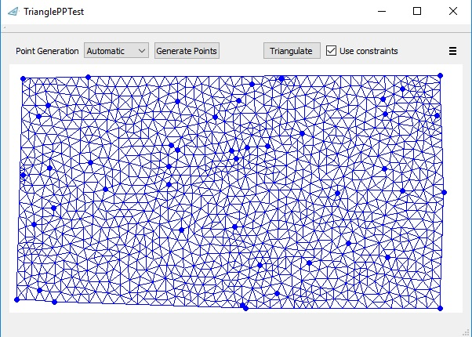
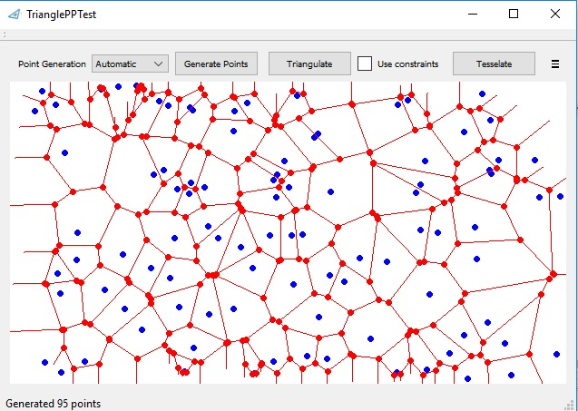

# Triangle++
[comment]: # "  "
 *Triangle++* (aka *TrianglePP*) is an updated version of Piyush Kumar's [C++/OO wrapper](https://bitbucket.org/piyush/triangle/overview) for the original 2005 J.P. Shevchuk's *Triangle* package that was written in old plain C.

It can create standard **Delaunay** triangulations, **quality Delaunay** triangulations, **constrained Delaunay** triangulations and **Voronoi** diagrams.

I have ported the original wrapper to Visual C++ (VisualStudio 2008/Win32), done some bugfixes, and extended it for constrainied triangulations and Voronoi diagrams. 

This code is released under LPGL licence.

## Update:

The code is now ported to x64 Windows. The project file was updated to Visual Studio 2015/2019, the x64 target was added, and the asserts & crashes when running the example program were fixed.

*CMake* support for both the example program and the GUI demonstrator were added recently and they work on both Linux and Windows. Also some basic Catch2 tests were added.

Support for reading and writing of *Triangle*'s file formats was also added (**Caution:** not yet complete!).

## Usage:

For usage patterns see the examples in the *trpp_example.cpp* source file. The interface of the *trpp*-wrapper is defined in the *tpp_inteface.hpp* header file. Basic usage example is shown in the code snippet below:

    // prepare input
    std::vector<Delaunay::Point> delaunayInput;
    
    delaunayInput.push_back(Delaunay::Point(0,0));
    delaunayInput.push_back(Delaunay::Point(1,1));
    delaunayInput.push_back(Delaunay::Point(0,2));
    delaunayInput.push_back(Delaunay::Point(3,3));

    // use standard triangulation
    Delaunay trGenerator(delaunayInput);
    trGenerator.Triangulate();

    // iterate over triangles
    for (FaceIterator fit = trGenerator.fbegin(); fit != trGenerator.fend(); ++fit)
    {
        int keypointIdx1 = trGenerator.Org(fit); 
        int keypointIdx2 = trGenerator.Dest(fit);
        int keypointIdx3 = trGenerator.Apex(fit);

        // access data
        double x1 = delaunayInput[keypointIdx1][0];
        double y1 = delaunayInput[keypointIdx1][1];
    }

If compiled with *TRIANGLE_DBG_TO_FILE* define, debug traces will be written to the *./triangle.out.txt* file.

## Demo App:

Additionally, under *testappQt* you'll find a GUI programm to play with the triangulations:

quality triangulations:

constrained triangulations:

(also with holes!):

(also without enclosing convex hull):

and with tesselations:

## Theory:

 

For backgroud info on the original implementation see "*Triangle: Engineering a 2D Quality Mesh Generator and Delaunay Triangulator*" by J.P. Shewchuk: http://www.cs.cmu.edu/~quake-papers/triangle.ps.

The original *Triangle* library documentation can be found at: http://www.cs.cmu.edu/~quake/triangle.html. The library was a **winner** of the 2003 James Hardy Wilkinson Prize in Numerical Software (sic!).

Algorithm used for DCT construction: "*Fast segment insertion and incremental construction of constrained Delaunay triangulations*", Shewchuk, J.R., Brown, B.C., Computational Geometry, Volume 48, Issue 8, September 2015, Pages 554-574 - https://doi.org/10.1016/j.comgeo.2015.04.006

## TODOs:
 - add support for sanitizing inputs with duplicates (work underway)
 - fix a bug in .poly file writing with holes (!!!)
 - fix a reading of .poly files with VisualStudio compiler (WTF???)
 - remove warnings
 - add support for regions and reading of region attributes from .poly file
 - add CI support (Travis?)
 - extract iterator code to own file (possible???)
 - add convex hull demonstration to the Qt demo app
 - Add support for all options in constrained triangulations (Steiner point constraints, regions, etc) (needed???)
 - Port the Qt demo app to Emscripten

