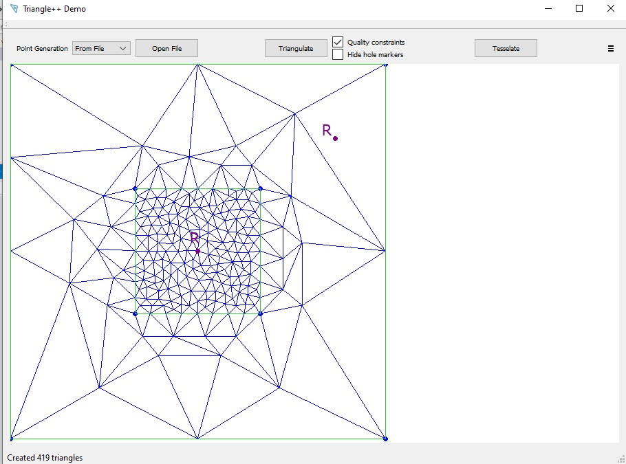
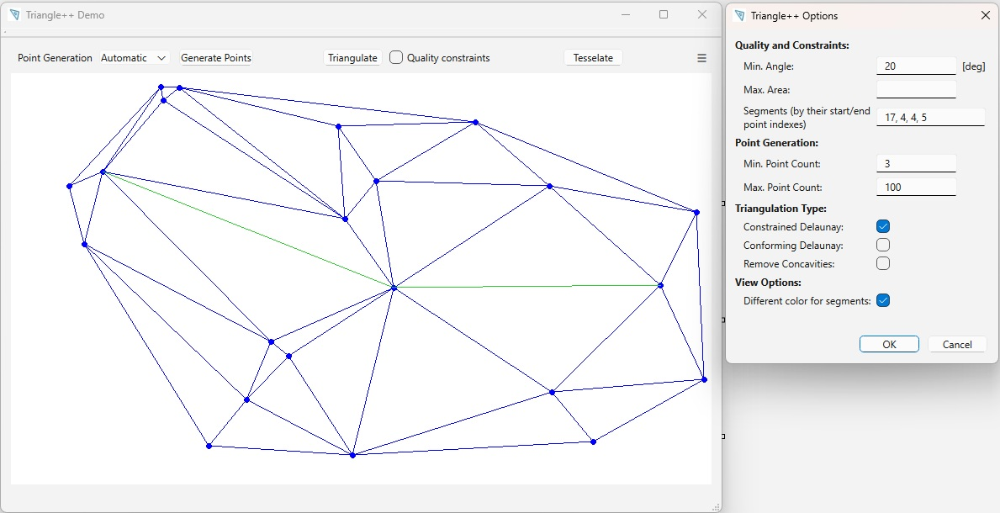
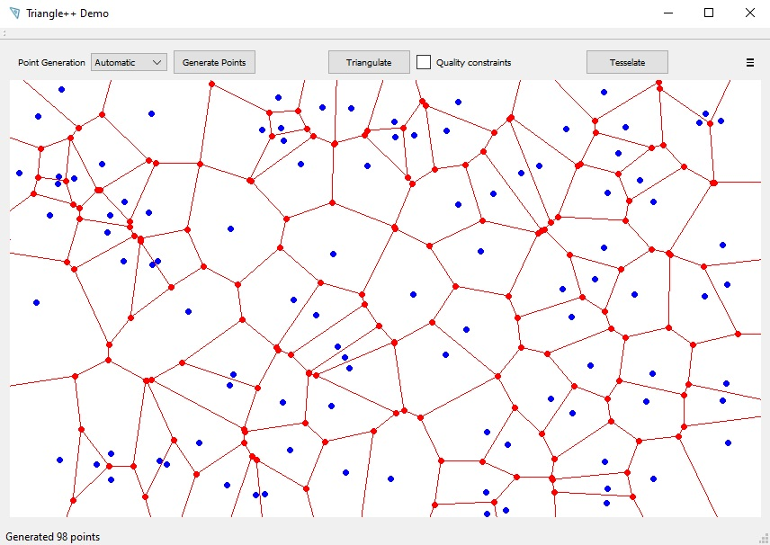

## Generating triangulations:

For usage patterns see the examples in the *trpp_example.cpp* source file. The interface of the *Tpp*-wrapper is defined in the *tpp_inteface.hpp* header file. 
Basic usage example is shown in the code snippet below:

    #include <tpp_interface.hpp>

    using namespace tpp;

    // prepare input
    std::vector<Delaunay::Point> delaunayInput = { ... };       

    // use standard triangulation
    Delaunay trGenerator(delaunayInput);
    trGenerator.Triangulate();

That's all! Now let's have a look at the generated triangulation.

### Iterating over results

    // iterate over triangles
    for (FaceIterator fit = trGenerator.fbegin(); fit != trGenerator.fend(); ++fit)
    {
        int vertexIdx1 = fit.Org();  // queries the input data index!
        int vertexIdx2 = fit.Dest();
        int vertexIdx3 = fit.Apex();

        // access point's cooridinates: 
        double x1 = delaunayInput[vertexIdx1][0];
        double y1 = delaunayInput[vertexIdx1][1];
    }

Note that the *vertexIndex* is relative to the input vertex vector! In case of Steiner points (i.e. points which were added by the algorithm) *vertexIndex* will be equal -1. 
In that case you can access Steiner points coordinates using an optional parameter, ase shown below:

        int vertexIdx1 = fit.Org(); 
        if (vertexIdx1 < 0)
        {
            // Steiner point!
            Delaunay::Point sp;
            f.Org(&sp);
        }

        // etc..

### Iterating with foreach() style loop

You can also use the *foreach()* style loop as shown below:

    for (const auto& f : trGenerator.faces())
    {
        int vertexIdx1 = f.Org();  // queries the input data index!
        int vertexIdx2 = f.Dest();
        int vertexIdx3 = f.Apex();

        // etc...
    }

### Iterating using mesh indexes

As we already mentioned, the vertex indices returned by face iterator are relative to the input vertex vector!
Thus in case of Steiner points (i.e. points which were added by the algorithm) the returned *vertexIndex* will be -1, which requres an additional if-clause and breaks code flow.

To avoid that we can generate a continuous indexing for all the points of the triangulation, as shown below:

    Delaunay trGenerator(inputPoints);
    trGenerator.enableMeshIndexGeneration(); // must be enabled!

    trGenerator.Triangulate(true);

    Delaunay::Point p0, p1, p2;
    int meshIdx0 = -1, meshIdx1 = -1, meshIdx2 = -1;

    for (auto fit = trGenerator.fbegin(); fit != trGenerator.fend(); ++fit)
    {
        fit.Org(p0, meshIdx0);  // queries the mesh index!
        fit.Dest(p1, meshIdx1);
        fit.Apex(p2, meshIdx2);
         
        ...
    }

In this case, the vertex coordinates will be always copied to the *point* parameter of the corresponding iterator's method.

### Other iterators

We can also iterate over all *points* of a triangulation using **VertexIterator** as shown below:

    // iterate over vertices
    for (VertexIterator vit = trGenerator.vbegin(); vit != trGenerator.vend(); ++vit)
    {
        int vertexIdx = vit.vertexId();  // queries the input data index!

        // point coordinates
        double x = vit.x();
        double y = vit.y();
    }

You can also use the *foreach()* style loop as shown below:

    for (const auto& v : trGenerator.vertices())
    {
        int vertexIdx = v.vertexId()
        ....
    }

### Mesh walking

The *TriangulationMesh* class provides operations on oriented triangles (aka faces) of a triangulation result, for example:

- Access the triangle adjoining the edge with number N
- Access the triangle opposite to current edge of the face
- Find the next edge (counterclockwise) of a triangle
- Find the previous edge (clockwise) of a triangle
- Find the next edge (counterclockwise) of a triangle with the same origin
- Find the next edge clockwise with the same origin
- Calculate incident triangles around a vertex
- etc.

You can access and use the *TriangulationMesh* class as shown below.

    TriangulationMesh mesh = trGenerator.mesh();

    // start with default current edge:
    auto fit = trGenerator.fbegin();
    auto firstAdjoningTriangle = fit.Sym();

    // move current edge:
    fit = mesh.Lnext(fit)
    auto secondAdjoningTriangle = fit.Sym();

    // move current edge:
    fit = mesh.Lnext(fit)
    auto thirdAdjoningTriangle = fit.Sym();

Note: the **current edge** of a triangle is the edge from origin *Org()* to destination *Dest()*. Operations moving the current edge will return a triangle with origin and destination changed acoordingly.

### Quality constraints

You can set some constraints for the triangulation, i.e. the **minimum angle** and **maximum area** for the resulting triangles like that:

    generator.setMaxArea(30);
    generator.setMinAngle(30); // in degrees

or
    generator.setQualityConstraints(30, 30);

However, the minimum angle constraint has some caveats. The documentation of the original *Triangle* package says the following:

"If the minimum angle is 28.6 degrees or smaller, *Triangle* is **mathematically guaranteed** to terminate (assuming infinite precision arithmetic - *Triangle* may fail to terminate if you run out of precision). In practice, *Triangle* often succeeds for minimum angles up to 34 degrees. For some meshes, however, you might need to reduce the minimum angle to avoid problems associated with insufficient floating-point precision."

There is a method in the Triangle++ API that checks current constraints for viability:

    /**
      @brief: Are the quality constraints acceptable?

      @param possible: set to true, if is highly *probable* for triangualtion to succeed
      @return: true if triangualtion is *guaranteed* to succeed
    */
    bool checkConstraints(bool& possible) const;

### Regions and region constraints

You can use following method in the Triangle++ API to set max area constraint for a region in the input mesh:

    /**
       @param regions: vector of 2 dimensional points where each points marks a regions, i.e. it infects all
                       triangles around in until it sees a segment
       @param areas:  max. triangle area for the region with the same index in the regions vector
       @return: true if the input is valid, false otherwise
      */
     bool setRegionsConstraint(const std::vector<Point>& regions, const std::vector<float>& areas);

You can also define region constraint in **.poly** input files, as shown in *tppDataFiles/box-regions.poly* example file. 

Example of 2 regions with constraints is shown below (using the Demo App):

### Segment constraints

As stated in http://www.cs.cmu.edu/~quake/triangle.defs.html : 

*"A Planar Straight Line Graph (PSLG) is a collection of vertices and segments. **Segments are edges** whose endpoints are vertices in the PSLG, and whose **presence in any mesh generated** from the PSLG **is enforced**."*

and:

*"A constrained Delaunay triangulation of a PSLG is similar to a Delaunay triangulation, but **each PSLG segment is present as a single edge** in the triangulation. A constrained Delaunay triangulation is not truly a Delaunay triangulation. Some of its triangles **might not be Delaunay**, but they are all constrained Delaunay."*

Now, the documentaion of the *Delaunay::Triangulate()* method says basically the same:

         If segment constraints are set, this method creates a constrained Delaunay triangulation where
         **each PSLG segment is present as a single edge in the triangulation**. Note that some of the resulting
         triangles might *not be Delaunay*! In quality triangulation *additional* vertices called Steiner 
         points may be created.

In the following figure, you can see the constrained Delaunay triangulation in action as to better visualize the influence of segment constraints on triangulation. Note that the constraining segments are shown in green.

### Conforming triangulations

As stated in http://www.cs.cmu.edu/~quake/triangle.defs.html : 

*"A conforming Delaunay triangulation (CDT) of a PSLG is a true Delaunay triangulation in which each PSLG segment may have been subdivided into several edges by the insertion of additional vertices, called Steiner points. Steiner points are necessary to allow the segments to exist in the mesh while maintaining the Delaunay property. Steiner points are also inserted to meet constraints on the minimum angle and maximum triangle area."*

and:

*"A constrained conforming Delaunay triangulation (CCDT) of a PSLG is a constrained Delaunay triangulation that includes Steiner points. It usually takes fewer vertices to make a good-quality CCDT than a good-quality CDT, because the triangles do not need to be Delaunay (although they still must be constrained Delaunay)."*

 - Docs:
          A conforming Delaunay triangulation is a *true Delaunay* triangulation in which **each constraining 
          segment may have been *subdivided* into several edges** by the insertion of *additional* vertices, called 
          Steiner points (@see: http://www.cs.cmu.edu/~quake/triangle.defs.html)

t.b.c. ...

### The Point class

Currently the dpoint class by Piyush Kumar is used: a d-dimensional *reviver::dpoint* class with d=2. 
If you want to use your own point class, you might have to work hard... 

 **OPEN TODO:**
  - decouple Delaunay::Point and Delaunay classes
  - templatize Delaunay class on the used Point type: Delaunay<class Point> { ... }

t.b.c. ...

## Generating Voronoi diagrams

Basic usage example for Voronoi diagrams is shown in the code snippet below:

    #include <tpp_interface.hpp>

    using namespace tpp;

    // prepare input
    std::vector<Delaunay::Point> tesselationPoints = { ... };       

    // tesselate
    Delaunay trGenerator(tesselationPoints);
    trGenerator.Tesselate();

That's all! Now let's have a look at the generated tesselation.

### Iterating over results

To iterate over results of Voronoi tesselation two iterator classes are provided:

 - *VoronoiVertexIterator* which enumerates the generated Voronoi points, and 
 - *VoronoiEdgeIterator* which shows how these points are connected.

 To illustrate the results let's have a look at the figure below:

The Voronoi vertices and edges are shown in red in the figure, while the tesselation input points are blue.

 We can use those iterator classes like this:

    // get points/vertices
    for (auto viter = trGenerator.vvbegin(); viter != trGenerator.vvend(); ++viter)
    {
        // access data
        auto point = *viter;
        double x = point[0];
        double y = point[1];

        // e.g.: draw point x,y
    }

    // ... and edges!
    for (auto eiter = trGenerator.vebegin(); eiter != trGenerator.veend(); ++eiter)
    {
        bool finiteEdge = false;
        Delaunay::Point pt1 = eiter.Org();
        Delaunay::Point pt2 = eiter.Dest(finiteEdge);

        // access data
        double xstart = pt1[0];
        double ystart = pt1[1];

        if (finiteEdge)
        {
            double xend = pt2[0];
            double yend = pt2[1];

            // e.g.: draw line pt1, pt2...
        }
        else
        {
            // an inifinite ray, thus no endpoint coordinates!
            auto rayNormalXValue = p2[0];
            auto rayNormalYValue = p2[1];
            assert(!(rayNormalXValue == 0.0 && rayNormalYValue == 0.0));

            // e.g.: draw an inifinite ray from pt1...
        }
    }

## Traces and Logs

If compiled with *TRIANGLE_DBG_TO_FILE* define, basic triangulation debug traces will be written to the *./triangle.out.txt* file. 

Moreover, debug traces for reading and writing point/segment files a separate output file can be used by calling the

 *Delaunay::enableFileIOTrace(true);*

 method. The file I/O traces are then written to the *./tpp_fileIO.out.txt* file. **Caution:** If this file is written, the basic triangulation debug traces won't be generated!

Additionally, debug output will be sent to stdout, depending on the traceLvl parameter in Triangulate() or Tesselate() methods.

## Library versions

Two versions of the library can be built:

 - library doing sanity checks while working (default setting): it will incure some performance overhead
   in this version several checks will be enabled in order to throw exceptions instead of just crashing or looping endelessly!!!

 - library without sanity checks for *maximum performance*
   for this the *TRIANGLE_NO_TRILIB_SELFCHECK* define must be set when compiling TrianglePP
   
### Branches
The Demo App GUI program was recently ported to Qt6. For that the Qt5 version of the repository was placed on a separate branch, which isn't planned to be maintained. 
Thus there will be no backports of fixes or new features for **both** *TrianglePP* library **and** the *Demo App* on the Qt5 branch if not explicitely requested by the users!

## File I/O

You can write and read ASCII files containing point and segement definitions using Triangle++ methods. Some examples are stored in the *tppDataFiles* directory. 
Documentation for the used formats can be found in [TriLib README.txt](./TriLib%2README.txt) in the *"File Formats"* section. The 2 most often used input formats are also shortly introduced below:

### .node files

As documentation at http://www.cs.cmu.edu/~quake/triangle.node.html is saying, the format of .node files can be specified as an ASCII file with following contents:

*"
.node files

    - First line: <# of vertices> <dimension (must be 2)> <# of attributes> <# of boundary markers (0 or 1)>
    - Remaining lines: <vertex #> <x> <y> [attributes] [boundary marker]

Blank lines and comments prefixed by `#' may be placed anywhere. Vertices must be numbered consecutively, starting from one or zero.

    ...
"*

t.b.c. ...

### .poly files

As documentation at http://www.cs.cmu.edu/~quake/triangle.poly.html is saying, the format of .poly files can be specified as an ASCII file with following contents:

*"
.poly files

    - First line: <# of vertices> <dimension (must be 2)> <# of attributes> <# of boundary markers (0 or 1)>
    - Following lines: <vertex #> <x> <y> [attributes] [boundary marker]
    - One line: <# of segments> <# of boundary markers (0 or 1)>
    - Following lines: <segment #> <endpoint> <endpoint> [boundary marker]
    - One line: <# of holes>
    - Following lines: <hole #> <x> <y>
    - Optional line: <# of regional attributes and/or area constraints>
    - Optional following lines: <region #> <x> <y> <attribute> <maximum area>

A .poly file represents a PSLG, as well as some additional information. PSLG stands for Planar Straight Line Graph, a term familiar to computational geometers. By definition, a PSLG is just a list of vertices and segments. A .poly file can also contain information about holes and concavities, as well as regional attributes and constraints on the areas of triangles.

    ...
*"

t.b.c. ...

### Input files sanitization

The library will try to sanitize the input data, as to prevent the triangulation algorithm from crashing or throwing an assert. At the moment following sanitizations are implemented:
 - removal of duplicated points in segment definitions

### Example TrianglePP data files

Example *.node*, *.poly* and *.area* files can be found in the *tppDataFiles* directory. The examples in this directory are ...

t.b.c. ...

## Theory:

 

The original *Triangle* library documentation can be found at: http://www.cs.cmu.edu/~quake/triangle.html. The library was a **winner** of the 2003 James Hardy Wilkinson Prize in Numerical Software (sic!).

For backgroud info on the original implementation see "*Triangle: Engineering a 2D Quality Mesh Generator and Delaunay Triangulator*" by J.P. Shewchuk: http://www.cs.cmu.edu/~quake-papers/triangle.ps (or the local copy listed below!).

Algorithm used for DCT construction: "*Fast segment insertion and incremental construction of constrained Delaunay triangulations*", Shewchuk, J.R., Brown, B.C., Computational Geometry, Volume 48, Issue 8, September 2015, Pages 554-574 - https://doi.org/10.1016/j.comgeo.2015.04.006

### Local TriLib documentation files:
 
1. **triangle.pdf** - J.R. Shevchuk, *"Triangle: Engineering a 2D Quality Mesh Generator and Delaunay Triangulator"*, copy of: 'http://www.cs.cmu.edu/~quake-papers/triangle.ps' - overview of the C implementation

2. **TriLib README.txt** - Docs extracted form Triangle's sources

3. **Delaunay Refinement Mesh Generation.pdf** - J.R. Shevchuk, *"Delaunay Refinement Mesh Generation"*, PhD dissertation, 1997 - general introduction to the Delaunay algorithms, detailed decription of 2D and 3D triangle refinement algorithms

4. **robust-predicates.pdf**  - J.R. Shevchuk, *"Robust Adaptive Floating-Point Geometric Predicates"* - discussion of some floating point techniques used
