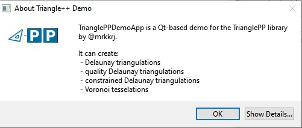
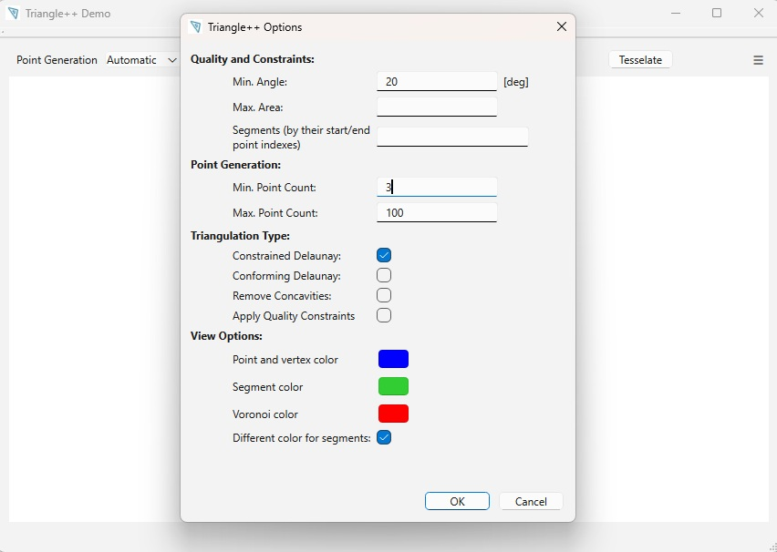
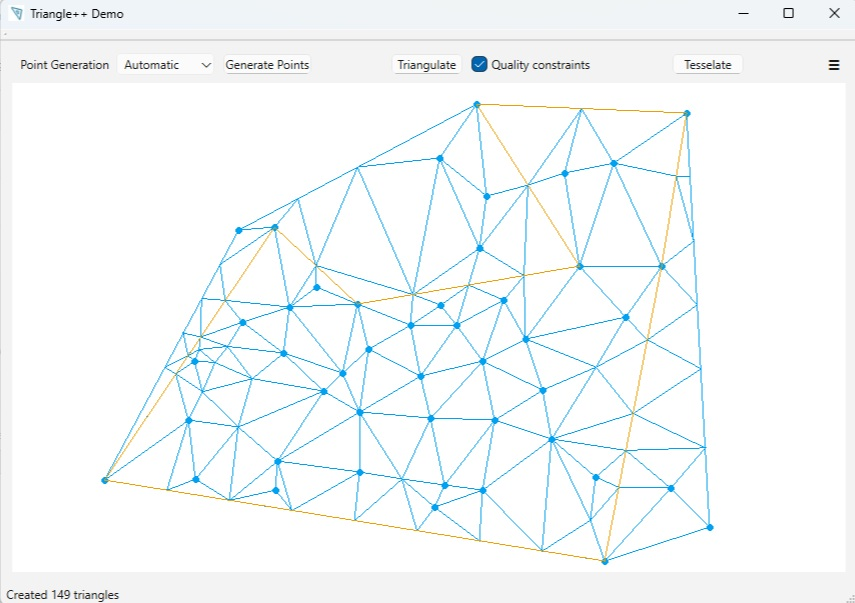
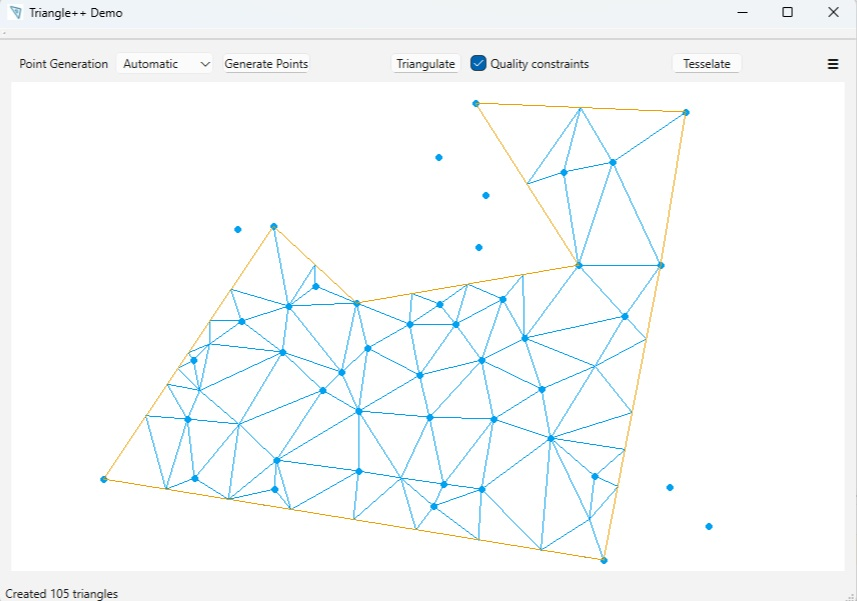
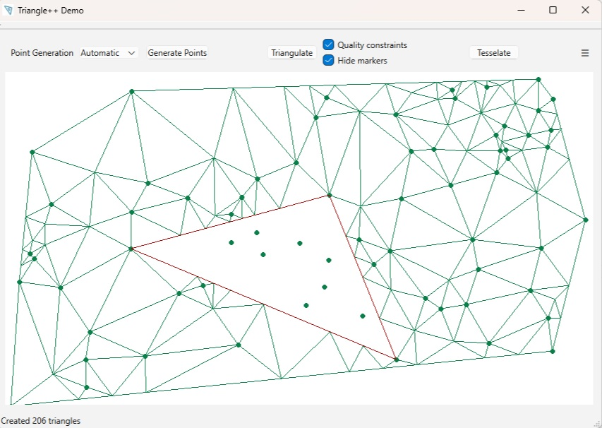
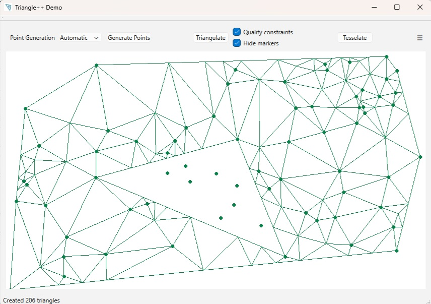

 
<!-- img src="../triangle-PP-sm.jpg" alt="triangle-PP's logo" width="160"/ -->
## Qt-based GUI Demonstrator for TrianglePP
 

A small demonstrator/tester for the library.
 

 

 

 - To see some screenshots showing what this demo app is able to do, please refer to the main *README* file of the project.
 - Also see below for the triangulation options available in th UI

## Options
The Demo App has same options that can be set, available in the *Options* menu (Ctrl+O):

As you see, we can set the colours using for painting triangulations in the UI, presets for point generation, and used quality constrains and triangulation modes. 
 - For explanation of triangualtion modes please refer to the main documentation.
 - the "Remove Concavities" option, when used with segment constraints, will remove all the triangles **outside** the polygon created by the segments. See below for examples:

    - without "Remove Concavities"

 

    - with "Remove Concavities"
    

 

Additionally, we can hide the hole and region markers while painting triangulations, as shown below:

 

By unchecking the *"Different colors for segments"* checkbox we can force usage of a single colour for painting triangulations, i.e. same colour for points, triangles and segments, as shown below:

 

tbc...

## Versions
Recently this Demo App was ported to Qt6. You will find the legacy Qt5 version on a separate branch, which isn't maintained at the moment, 
i.e. there will be no backports of fixes or new features if not explicitely requested by the users!

 

**Note:** On Windows the Demo App will be compiled with *TRIANGLE_DBG_TO_FILE* define, so that its debug traces will be written to the *./triangle.out.txt* file. 
On Linux the traces will be written to the console instead.

## TODOs:

 - add visual GUI support for adding region markers and region constraints (at the moment they can only be read from a *.poly* file!)
 - save current settings and re-read them on restart

 - remove warnings
 - correct rescaling so that points on the border of frame will be entirely visible (needed ???)
 - rescale the inputs only on explicit request (and back...) 
   - needed ??? --> we already added zooming
 
 - add convex hull demonstration (worth it ???)

 - port demo app to Emscripten
 - port demo app to Python
