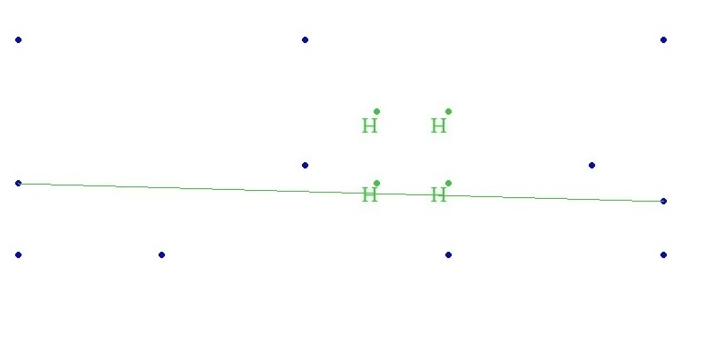
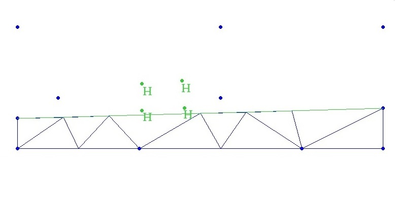

 
<!-- img src="../triangle-PP-sm.jpg" alt="triangle-PP's logo" width="160"/ -->
## Tests:

These are the preliminary test cases for the Triangle++ package. 

 - Note that the Visual Studio solution uses the "*TRIANGLE_DBG_TO_FILE*" define in the Debug mode to enable log output to the *triangle.out.txt* file.

 - the test for constrained Delaunay uses following data:

 - and for constrained Delaunay with holes we add these:

<kbd></kbd>

 - ...which then results in following (quality) triangulation:

<kbd></kbd>

## TODOs:
 - add a more tests for triangulations
